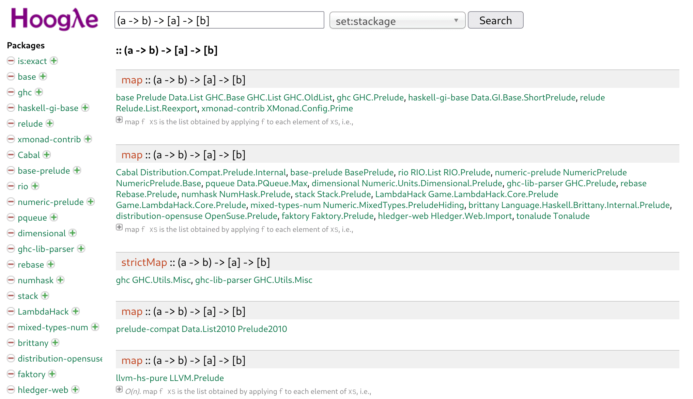

## Функции и функциональное программирование

- Функция в математике, например: $f(x) = x^3$ \pause
	- ставит в соответствие аргументу некоторый результат и всё
- А в программировании? \pause
	- может не завершиться
		- `int calc() { while (true) {}; return 0; }` \pause
	- может иметь *побочные эффекты*
		- `int calc() { printf("hi!\n"); return 1; }` \pause
- Суть парадигмы ФП в двух словах — приблизиться к математическим функциям \pause
- Язык Haskell: «чистые» функции + продвинутая система типов

## Мотивация

Зачем приближаться к математическим функциям? \pause

- Ссылочная прозрачность (referential transparency)!
	- т.е. можно рассуждать о программе как о системе перезаписи \pause
	- Огромный потенциал для анализа и оптимизации программ
		- Можно кэшировать общие подвыражения, параллелить вычисление подвыражений \pause
- Явные рассуждения об эффектах \pause
	- Разграничение доступных возможностей в разных местах кода
	- Например «в этой функции можно только вычислять и писать в лог»

## Поехали

- Консоль GHCi онлайн: https://www.tryhaskell.org/
- Компилятор + консоль онлайн: https://replit.com/languages/haskell \pause
- Домашнее задание: установить инструментарий :)
	- Инструмент сборки `stack`: https://haskellstack.org
		- Сам управляет версиями компилятора
	- VS Code: расширение Haskell
	- Другие редакторы с поддержкой LSP: настраиваем haskell-language-server вручную

## Арифметика и логика

```haskell
$ ghci
Prelude> 123 + 456
579
Prelude> 111 + 222 > (123 + 456) || 1 < 0
False
```

Кажется, все как обычно. \pause

```haskell
Prelude> True != False

<interactive>:11:6: error:
    • Variable not in scope: (!=) :: Bool -> Bool -> t
    • Perhaps you meant one of these:
        ‘>=’ (imported from Prelude), ‘==’ (imported from Prelude),
        ‘/=’ (imported from Prelude)
```

Только неравенство пишется как `/=`, а не `!=`!

## Операторы

```haskell
    • Variable not in scope: (!=) :: Bool -> Bool -> t
```

Когда мы использовали несуществующий оператор `!=`, интерпретатор не нашёл переменную `(!=)` типа `Bool -> Bool -> t` в текущей области видимости. \pause

Операторы — не встроенные особые конструкции, а просто функции! Попробуем вызвать привычным образом? \pause

```haskell
Prelude> (&&)(True, False)
<interactive>:16:5: error:
    • Couldn't match expected type ‘Bool’
                  with actual type ‘(Bool, Bool)’
```

Ой: мы создали *пару* (кортеж из 2 элементов) ?!

## Операторы

На самом деле вызов функции выглядит так:

```haskell
Prelude> (&&) True False
False
Prelude> max 4 2
4
```

\pause И наоборот, обычную функцию тоже можно использовать как оператор (в инфиксной записи):

```haskell
Prelude> 2 `max` 4
4
```

## Функции

Почему вызов выглядит как `max 4 2`? Почему типы выглядят как `Bool -> Bool -> Bool`? Что происходит?? \pause

Функция двух аргументов — на самом деле функция одного аргумента, возвращающая функцию одного аргумента, возвращающая результат!

```haskell
max :: Integer -> (Integer -> Integer)
max 4 :: Integer -> Integer
max 4 2 :: Integer
```

\pause

```haskell
Prelude> (max 4) 2
4
Prelude> :t +d (max 4)
(max 4) :: Integer -> Integer
```

Это сделано для удобства *частичного применения*.

## Списки

Частичное применение удобно для передачи функций в качестве аргументов другим функциям.

Рассмотрим работу со списками.

Функция `map` применяет функцию ко всем элементам списка:

```haskell
Prelude> map (+ 1) [12, 34, 56]
[13,35,57]
```

\pause Кстати, с помощью синтаксиса `..` можно генерировать диапазоны:

```haskell
Prelude> map (max 4) [1..10]
[4,4,4,4,5,6,7,8,9,10]
```

## Операции со списками

В стандартной библиотеке много функций для работы со списками, например:

```haskell
Prelude> reverse [1,2,3,4,5]
[5,4,3,2,1]
Prelude> [True, False] ++ [False, True]
[True,False,False,True]
Prelude> head [1,2,3]
1
Prelude> tail [1,2,3]
[2,3]
Prelude> take 2 [11,22,33,44,55]
[11,22]
Prelude> concat [[1,2],[],[3],[4,5,6]]
[1,2,3,4,5,6]
```

\pause Но вернёмся к `map`…

## Определяем функции

Чтобы (например) передать `map` произвольное выражение, нужно определить свою функцию.
Анонимные функции задаются лямбда-выражениями:

```haskell
Prelude> map (\x -> x * 2 + x * 3) [1,2,3,4,5]
[5,10,15,20,25]
Prelude> (\x -> x * 2 + x * 3) 5
25
```

\pause Чтобы функция перестала быть анонимной, мы можем локально связать её с названием с помощью конструкции `let .. in`:

```haskell
Prelude> let myfunc = \x -> x * 2 + x * 3 in map myfunc [1,2,3,4,5]
[5,10,15,20,25]
```

\pause Синтаксический сахар позволяет опустить лямбда-синтаксис:

```haskell
Prelude> let myfunc x = x * 2 + x * 3 in map myfunc [1,2,3,4,5]
[5,10,15,20,25]
```

## Функции в списках

Кстати, можно и так:

```haskell
Prelude> map (\x -> x 123) [ (3 *), (* 2), (+ 1)
                           , (`mod` 6), \x -> (x + 1) * (x - 1) ]
[369,246,124,3,15128]
```

\pause «Functions are first-class citizens»: их можно не только передавать как аргументы другим функциям, но и хранить в любых структурах данных.

## Задаём функции

В консоли GHCi можно также глобально определить функцию для всей последующей сессии:

```haskell
Prelude> myfunc x = x * 2 + x * 3
Prelude> myfunc 32
160
Prelude> map myfunc [1..10]
[5,10,15,20,25,30,35,40,45,50]
```

\pause В `.hs` файле определения на верхнем уровне как правило даются с явной аннотацией типов:

```haskell
myfunc :: Integer -> Integer
myfunc x = x * 2 + x * 3
```

## Условные выражения

Конструкция `if` является выражением, подобно тернарному оператору `?:` в императивных языках:

```haskell
Prelude> if 2 > 1 then 222 else 111
222
```

\pause Теперь мы можем, например, определять рекурсивные функции с условием завершения:

```haskell
fib :: Integer -> Integer
fib x = if x == 0 || x == 1 then x else fib (x - 2) + fib (x - 1)
```

\pause

```haskell
Prelude> fib 4
3
Prelude> map fib [0..10]
[0,1,1,2,3,5,8,13,21,34,55]
```

\pause Рекурсия — базовый приём в функциональном программировании, однако на практике мы чаще используем её скрыто, внутри библиотечных функций вроде `map`.

## Условные выражения, без условных выражений

Ту же функцию можно записать компактнее, практически в виде математических уравнений:

```haskell
fib :: Integer -> Integer
fib 0 = 0
fib 1 = 1
fib x = fib (x - 2) + fib (x - 1)
```

\pause На самом деле это эквивалентно использованию конструкции `case`:

```haskell
fib a = case a of
          0 -> 0
          1 -> 1
          x -> fib (x - 2) + fib (x - 1)
```

## Сопоставление с образцом

`case` — pattern matching («сопоставление с образцом»).

В отличие от `switch` в Си-подобных языках, это *выражение*, которое «разбирает» входное значение.
Ветви могут как сравнивать с константами, так и связывать имена.
Даже во вложенных значениях:

```haskell
Prelude> case (1, [2, 3, 4]) of (_, [x, y, 4]) -> x * y
6
```

\pause

```haskell
calc23 :: [Integer] -> Integer
calc23 [x, y] = x * 2 + y * 2
calc23 [x, 1, y] = x * 3 + y * 3
calc23 _ = 0
```

```haskell
*Test> calc23 [2,2]
8
*Test> calc23 [2,1,2]
12
*Test> calc23 [2,2,2]
0
```

## Типы функций

```haskell
twice f val = (f val, f val)
```

Какой тип у этой функции? \pause

```haskell
Prelude> :t twice
twice :: (t -> b) -> t -> (b, b)
```

Компилятор автоматически вывел наиболее общий тип.
Этой функции всё равно, значениями каких типов оперирует `f`, поэтому мы видим *параметры*, или *переменные* (с маленькой буквы) вместо конкретных типов.

\pause Не говорите слова «generic» и «template», они оба имеют другие значения в мире Haskell :)

Такие функции называются полиморфными.

## Параметрический полиморфизм и его интересные последствия

Самый глубокий слайд на сегодня. \pause

Сколько реализаций существует у функции такого типа?

```haskell
id :: a -> a
```

\pause Одна, очевидная.

```haskell
id x = x
```

Нам просто *неоткуда* больше взять результат типа `a`, кроме как из аргумента!!

\pause Хотя, я вас немного обманул. На самом деле можно взять значение `undefined` / `error "msg"`, которое имеет любой тип (`undefined :: a`) и выкидывает исключение при означивании.

```haskell
id _ = undefined
```

Но всё же, по сигнатуре функции зачастую можно однозначно понять, что она делает.
Поэтому популярен поиск по типам (Hoogle / Hayoo), разрабатываются инструменты синтеза кода (Synquid).

## Поиск по типам



## Ограниченный параметрический полиморфизм

Какого типа функция `max` на самом деле?

```haskell
Prelude> :t max
max :: Ord a => a -> a -> a
```

Она тоже полиморфная, но у неё есть *контекст*, содержащий *ограничение*: тип `a` должен быть «упорядочиваемым» (`Ord`).

\pause Числовые константы, кстати, тоже полиморфны:

```haskell
Prelude> :t 123
123 :: Num p => p
```

Забегая вперёд скажем, что эти слова `Ord`, `Num` — названия *классов типов*.

## Практические полезности

В стандартной библиотеке определён оператор:

```haskell
($) :: (a -> b) -> a -> b
f $ x = f x
```

Зачем? \pause

```haskell
Prelude> take 2 (filter (> 10) (map (* 2) [1..10]))
[12,14]
Prelude> take 2 $ filter (> 10) $ map (* 2) [1..10]
[12,14]
```

Он определён с наименьшим приоритетом и соответственно предназначен для избавления от скобок.
Таким образом можно писать последовательности трансформаций данных подобно UNIX pipes, только справа налево.

## {.standout}

Спасибо за внимание!
